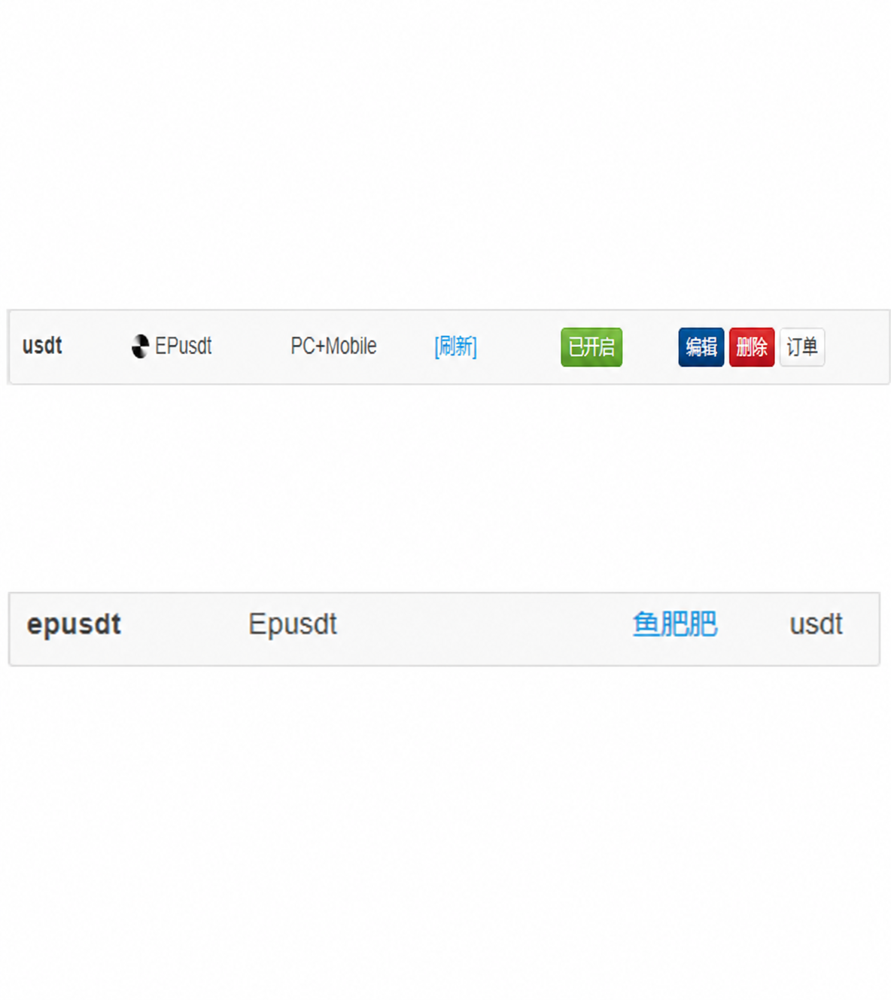
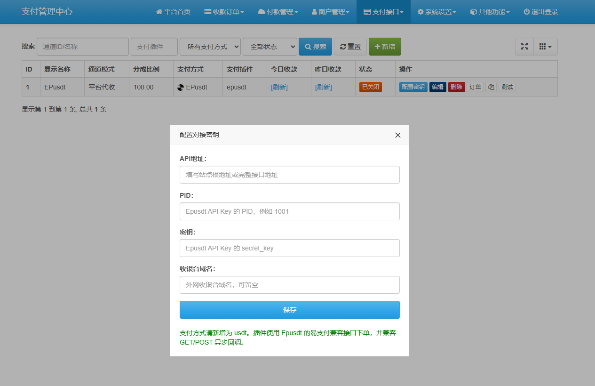

  

  
  
  
  

# Epay-epusdt

 鱼肥肥 [@pyufc](https://t.me/pyufc) 此款插件是基于 [Epay](https://github.com/Yufeifeio/Epay) 开发，其它版本易支付不保证100%可用！

  

## 说明

本仓库提供 Epusdt 对接易支付的插件发布包，适配保持 Epay 兼容接口的 Epusdt 版本，放入易支付即可直接对接。

## 安装

1. 将 `plugins/epusdt/epusdt_plugin.php` 放入易支付对应插件目录。
2. 将 `assets/icon/usdt.ico` 放入易支付支付方式图标目录。
3. 在后台新增支付方式 `usdt`。
4. 配置：
   - `appurl`：Epusdt 接口地址，支持填写站点根地址或完整接口地址
   - `appid`：PID
   - `appkey`：secret_key
   - `appswitch`：公网收银台域名；当 `appurl` 是内网地址时必须填写
   - `appselector`：支付资产，默认 `usdt.tron`；如需其它链请填写 Epusdt 已启用的 `token.network`

## 兼容说明

- 下单走 Epusdt 的易支付兼容接口。
- 适配 Epusdt v1.0.9+ 的 EPay `type` 规则，默认提交 `type=usdt.tron`，避免 `type=usdt` 被新版 Epusdt 判定为参数错误。
- 支持将 `appurl` 填写为站点根地址、`mapi.php`、`submit.php` 或完整的 Epay 兼容接口地址。
- API Key 的 PID 建议使用数字；Epusdt 的 EPay 回调会按数字 PID 输出。
- `notify_url` 必须是公网可访问地址，本地地址和内网地址会被 Epusdt 拦截。
- 回调兼容 `GET` 和 `POST`。
- 异步回调成功返回 `success`。

## 相关截图

  
  

